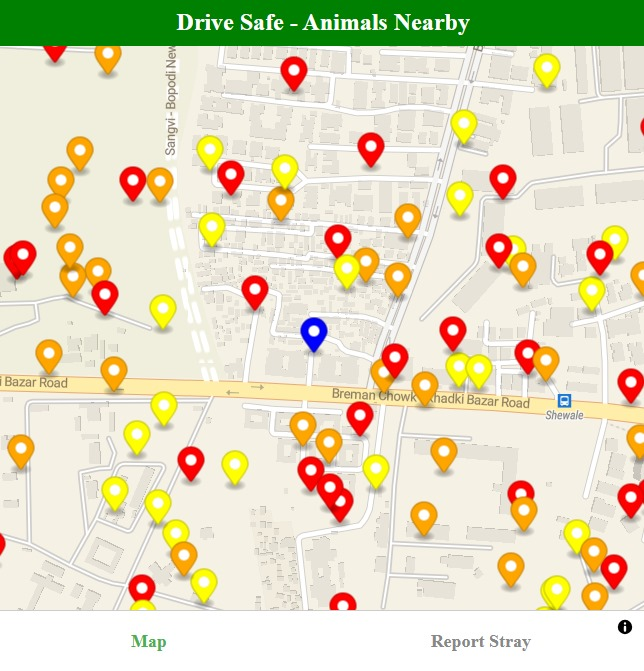
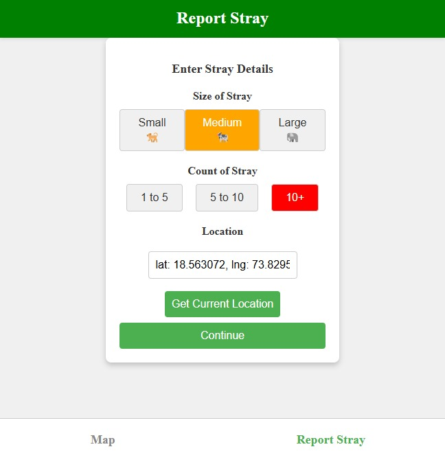
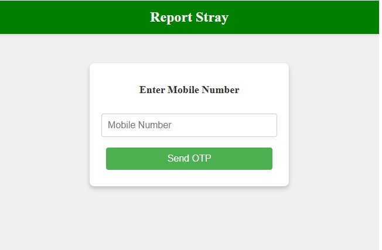

---

# HELPASHU (HELP-PASHU)

The **HELPASHU - Stray Animal Reporting System** is a comprehensive solution to identify and report stray animals, helping to ensure road safety and improve animal welfare. This project consists of a **React.js frontend** and a **Flask backend**, supported by MongoDB for data storage.

---

## 🚀 Features

### 1. **Stray Animal Reporting**
- Users can report stray animals by providing details such as **size**, **count**, and **location**.
- Allows users to fetch their current location using geolocation services or manually input location details.

### 2. **Real-Time Map Visualization**
- Displays user location and nearby reported stray animals on an interactive map.
- Uses **MapLibre** with a **MapTiler** API for map rendering.

### 3. **OTP-Based Authentication**
- Secure mobile number verification ensures only genuine users can report stray animals.

### 4. **Dynamic Animal Markers**
- Stray reports are marked on the map with color-coded markers based on animal size:
  - 🟢 Small (e.g., dogs)
  - 🟠 Medium (e.g., cows)
  - 🔴 Large (e.g., elephants)

### 5. **Notifications for Municipal Corporations**
- Automatically sends alerts to the municipal corporation for timely action and rehabilitation of reported stray animals.

### 6. **Road Safety Alerts for Drivers**
- Provides road safety insights by identifying routes with higher stray animal occurrences, helping drivers make safer travel decisions.

### 7. **Machine Learning-Driven Analysis**
- Uses ML algorithms to analyze patterns in stray animal reports and predict "to-be-safe zones," alerting users to potential hotspots.

### 8. **Administrative Tools**
- Facilitates follow-ups by local administrations for effective stray management and road safety improvements.

### 9. **Enhanced Road Safety Measures**
- Helps prevent accidents by identifying high-risk zones for stray animal sightings and providing actionable data to authorities.

### 10. **Responsive and User-Friendly Design**
- Fully responsive interface ensures the app is accessible across all devices, empowering users to report strays anytime, anywhere.

---

## 🌟 Novelty Factor

- **Proactive Road Safety Solution**: Unlike existing reactive approaches, this system identifies high-risk zones and notifies drivers in advance, significantly reducing accidents caused by stray animals.  
- **Data-Driven Insights for Authorities**: Leverages machine learning to analyze patterns in stray animal sightings, enabling authorities to allocate resources more effectively and plan targeted interventions.  
- **End-to-End Ecosystem**: Integrates reporting, visualization, notifications, and analysis into a seamless system, creating a holistic approach to both animal welfare and public safety.  
- **Real-Time Municipal Collaboration**: Automates the process of notifying municipal corporations for quicker rehabilitation actions, ensuring timely resolutions and minimizing risks for both animals and humans.  
- **Driver-Friendly Features**: Provides route-specific alerts to drivers, marking safer and higher-risk roads, particularly useful for highways and remote areas.  
- **Predictive Analysis for Safer Roads**: Combines stray report data with ML algorithms to predict potential high-risk zones, allowing authorities to proactively implement safety measures.  
- **Inclusive and Scalable Design**: Designed to cater to diverse user groups, from local communities to municipal authorities, ensuring wide adoption and impact.  
- **Interactive Visualization**: Real-time, color-coded markers on the map provide an intuitive and engaging way for users to understand and act on stray reports.  
- **Empowering Local Communities**: By involving citizens in reporting and awareness, the platform builds a collective sense of responsibility towards road safety and animal welfare.  
- **Highly Adaptable Framework**: The system can be scaled to incorporate additional safety modules, such as wildlife alerts or environmental monitoring, making it future-ready for broader applications.  

### 🏆 Competitive Edge
This solution not only addresses a pressing societal issue but also introduces a unique combination of real-time collaboration, predictive analytics, and user-friendly design, making it a standout entry in the hackathon.

## 🛠 Why These Technologies?

### Frontend: **React.js with Vite**
- **React**:
  - Component-based structure makes UI reusable and scalable.
  - Excellent support for state management using hooks.
- **Vite**:
  - Superfast builds and dev server compared to Create React App.
  - Optimized for modern JavaScript, resulting in better performance.

### Backend: **Flask**
- **Lightweight and Efficient**:
  - Ideal for small, focused applications like this.
- **Python-Based**:
  - Allows seamless integration with geospatial libraries and ML (future scope).

### Map Rendering: **MapLibre with MapTiler**
- Open-source alternative to Google Maps for customization.
- MapTiler offers a generous free tier and beautiful map styles.
- MapLibre ensures fast rendering and smooth map interactions.

### Database: **MongoDB**
- **NoSQL Design**:
  - Perfect for dynamic, unstructured data like geospatial coordinates and user reports.
- **Scalability**:
  - Can handle a growing number of reports efficiently.

### OTP Authentication: **Twilio**
- Industry leader in SMS services for reliable OTP delivery.

---

## 📸 Screenshots

### 1. **Map View**  
_Displaying the user location and nearby reported stray animals._  


---

### 2. **Report Stray**  
_Enter the report details._



_Ensuring secure user authentication._  


---

## 🛠 Installation and Setup

### Prerequisites
- **Node.js** and **npm**: [Download here](https://nodejs.org/)
- **Python 3.x**: [Download here](https://www.python.org/)
- **MongoDB**: [Download here](https://www.mongodb.com/try/download/community)

### Steps to Run Locally

1. **Clone the Repository**:

   ```bash
   git clone https://github.com/saipy10/Save_The_Stray_Challenge.git
   cd Save_The_Stray_Challenge
   ```

2. **Setup Backend**:
   - Navigate to the `backend` folder:

     ```bash
     cd helpashu-backend
     ```

   - Create and activate a virtual environment:

     ```bash
     python -m venv venv
     source venv/bin/activate  # Windows: venv\Scripts\activate
     ```

   - Install dependencies:

     ```bash
     pip install -r requirements.txt
     ```

   - Create a `.env` file with the required variables (see below).
   - Run the backend:

     ```bash
     flask run
     ```

3. **Setup Frontend**:
   - Navigate to the `frontend` folder:

     ```bash
     cd ../helpashu-frontend
     ```

   - Install dependencies:

     ```bash
     npm install
     ```

   - Create a `.env` file in the root with the following:

     ```env
     VITE_MAPTILER_API_KEY=your_api_key
     VITE_BACKEND_URL=http://127.0.0.1:5000
     ```

   - Run the frontend:

     ```bash
     npm run dev
     ```

4. **Access the Application**:
   - Frontend: Open [http://localhost:5173](http://localhost:5173)
   - Backend: Open [http://localhost:5000](http://localhost:5000)

---

## 📂 Project Structure

```
project/
│
├── backend/              # Flask backend
│   ├── app.py
│   ├── requirements.txt
│   └── .env
│
├── frontend/             # React frontend
│   ├── src/
│   │   ├── components/
│   │   ├── App.jsx
│   │   └── main.jsx
│   ├── public/
│   ├── package.json
│   └── .env
│
├── screenshots/          # Screenshots for README
└── README.md
```

---

## 📡 API Endpoints

### Backend (`http://localhost:5000`):
- **POST `/send-otp`**: Sends an OTP to the given mobile number.
- **POST `/verify-otp`**: Verifies the entered OTP.
- **GET `/locations`**: Fetches all reported stray animal locations.

---

## 🚀 Future Enhancements
- **Machine Learning**:
  - Use more ML models to detect stray animals using images.
- **Gamification**:
  - Reward users for active participation and accurate reporting.
- **Strong Integration with Local Authorities**:
  - Notify relevant authorities for timely action.

---

## 💡 Conclusion

This project combines safety, innovation, and technology to create a meaningful impact on road safety and animal welfare. With its user-friendly interface, robust backend, and real-time map visualization, it offers a novel solution to a widespread problem.

---

## 🤝 Contributing

1. Fork the repository.
2. Create a feature branch (`git checkout -b feature/your-feature`).
3. Commit your changes (`git commit -m "Add your feature"`).
4. Push to the branch (`git push origin feature/your-feature`).
5. Open a pull request.

---

## 📜 License

This project is licensed under the [MIT License](LICENSE).

--- 

Let me know if you need further refinements!
